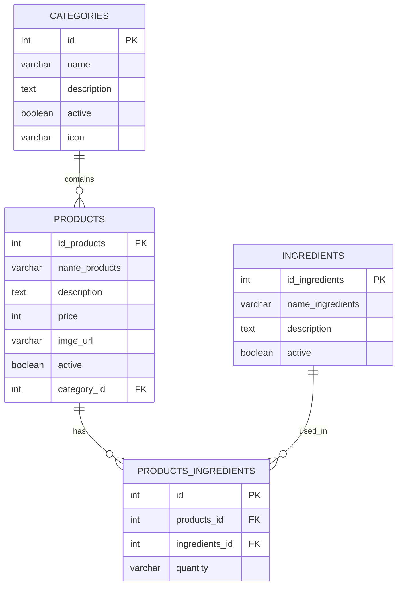

## Overview

The Q_SP API requires a PostgreSQL database with a manually created schema. This guide covers database setup, schema creation, and connection configuration.

<Warning>
  The application is configured with `spring.jpa.hibernate.ddl-auto=none`, which means Hibernate will **not** automatically create or update your database schema. You must manually create the tables before starting the application.
</Warning>

## Prerequisites

Before setting up the database, ensure you have:

- PostgreSQL 12 or higher installed
- Database administrator credentials
- A PostgreSQL client (psql, pgAdmin, or DBeaver)

## Database Creation

### Create Database

First, create a new database for the Q_SP API:

```sql
CREATE DATABASE q_sp_db;
```

### Create User (Optional)

For security, create a dedicated user for the application:

```sql
-- Create user
CREATE USER q_sp_user WITH PASSWORD 'your_secure_password';

-- Grant privileges
GRANT ALL PRIVILEGES ON DATABASE q_sp_db TO q_sp_user;

-- Connect to the database
\c q_sp_db

-- Grant schema privileges
GRANT ALL ON SCHEMA public TO q_sp_user;
```

## Schema Setup

The Q_SP API manages four main entities: Categories, Products, Ingredients, and ProductIngredients. Create the tables in the correct order to maintain referential integrity.

<Steps>
  <Step title="Create Categories Table">
    Categories are independent and must be created first:
    
    ```sql
    CREATE TABLE categories (
        id SERIAL PRIMARY KEY,
        name VARCHAR(255) NOT NULL,
        description TEXT,
        active BOOLEAN DEFAULT true,
        icon VARCHAR(255)
    );
    ```
    
    **Columns:**
    - `id` - Auto-incrementing primary key
    - `name` - Category name (required)
    - `description` - Optional category description
    - `active` - Status flag (defaults to true)
    - `icon` - Optional icon identifier or URL
  </Step>

  <Step title="Create Products Table">
    Products reference categories via foreign key:
    
    ```sql
    CREATE TABLE products (
        id_products SERIAL PRIMARY KEY,
        name_products VARCHAR(255) NOT NULL,
        description TEXT,
        price INTEGER NOT NULL,
        imge_url VARCHAR(500),
        active BOOLEAN DEFAULT true,
        category_id INTEGER,
        CONSTRAINT fk_category FOREIGN KEY (category_id) 
            REFERENCES categories(id) ON DELETE SET NULL
    );
    ```
    
    **Columns:**
    - `id_products` - Auto-incrementing primary key
    - `name_products` - Product name (required)
    - `description` - Optional product description
    - `price` - Product price in integer format (e.g., cents)
    - `imge_url` - URL to product image
    - `active` - Status flag (defaults to true)
    - `category_id` - Foreign key to categories table
    
    <Note>
      The `category_id` uses `ON DELETE SET NULL`, so deleting a category won't delete products, but will set their category to NULL.
    </Note>
  </Step>

  <Step title="Create Ingredients Table">
    Ingredients are independent entities:
    
    ```sql
    CREATE TABLE ingredients (
        id_ingredients SERIAL PRIMARY KEY,
        name_ingredients VARCHAR(255) NOT NULL,
        description TEXT,
        active BOOLEAN DEFAULT true
    );
    ```
    
    **Columns:**
    - `id_ingredients` - Auto-incrementing primary key
    - `name_ingredients` - Ingredient name (required)
    - `description` - Optional ingredient description
    - `active` - Status flag (defaults to true)
  </Step>

  <Step title="Create Products-Ingredients Junction Table">
    This table creates the many-to-many relationship between products and ingredients:
    
    ```sql
    CREATE TABLE products_ingredients (
        id SERIAL PRIMARY KEY,
        products_id INTEGER NOT NULL,
        ingredients_id INTEGER NOT NULL,
        quantity VARCHAR(255),
        CONSTRAINT fk_product FOREIGN KEY (products_id) 
            REFERENCES products(id_products) ON DELETE CASCADE,
        CONSTRAINT fk_ingredient FOREIGN KEY (ingredients_id) 
            REFERENCES ingredients(id_ingredients) ON DELETE CASCADE
    );
    ```
    
    **Columns:**
    - `id` - Auto-incrementing primary key
    - `products_id` - Foreign key to products table
    - `ingredients_id` - Foreign key to ingredients table
    - `quantity` - Quantity or amount of ingredient (stored as text for flexibility)
    
    <Note>
      Both foreign keys use `ON DELETE CASCADE`, so deleting a product or ingredient will automatically remove associated junction records.
    </Note>
  </Step>

  <Step title="Create Indexes (Optional but Recommended)">
    Add indexes to improve query performance:
    
    ```sql
    -- Index for product lookups by category
    CREATE INDEX idx_products_category ON products(category_id);
    
    -- Indexes for junction table lookups
    CREATE INDEX idx_products_ingredients_product 
        ON products_ingredients(products_id);
    CREATE INDEX idx_products_ingredients_ingredient 
        ON products_ingredients(ingredients_id);
    
    -- Index for active products
    CREATE INDEX idx_products_active ON products(active);
    CREATE INDEX idx_categories_active ON categories(active);
    CREATE INDEX idx_ingredients_active ON ingredients(active);
    ```
  </Step>
</Steps>

## Complete Schema Script

Here's the complete SQL script to create all tables at once:

<CodeGroup>
```sql schema.sql
-- Create Categories Table
CREATE TABLE categories (
    id SERIAL PRIMARY KEY,
    name VARCHAR(255) NOT NULL,
    description TEXT,
    active BOOLEAN DEFAULT true,
    icon VARCHAR(255)
);

-- Create Products Table
CREATE TABLE products (
    id_products SERIAL PRIMARY KEY,
    name_products VARCHAR(255) NOT NULL,
    description TEXT,
    price INTEGER NOT NULL,
    imge_url VARCHAR(500),
    active BOOLEAN DEFAULT true,
    category_id INTEGER,
    CONSTRAINT fk_category FOREIGN KEY (category_id) 
        REFERENCES categories(id) ON DELETE SET NULL
);

-- Create Ingredients Table
CREATE TABLE ingredients (
    id_ingredients SERIAL PRIMARY KEY,
    name_ingredients VARCHAR(255) NOT NULL,
    description TEXT,
    active BOOLEAN DEFAULT true
);

-- Create Products-Ingredients Junction Table
CREATE TABLE products_ingredients (
    id SERIAL PRIMARY KEY,
    products_id INTEGER NOT NULL,
    ingredients_id INTEGER NOT NULL,
    quantity VARCHAR(255),
    CONSTRAINT fk_product FOREIGN KEY (products_id) 
        REFERENCES products(id_products) ON DELETE CASCADE,
    CONSTRAINT fk_ingredient FOREIGN KEY (ingredients_id) 
        REFERENCES ingredients(id_ingredients) ON DELETE CASCADE
);

-- Create Indexes
CREATE INDEX idx_products_category ON products(category_id);
CREATE INDEX idx_products_ingredients_product ON products_ingredients(products_id);
CREATE INDEX idx_products_ingredients_ingredient ON products_ingredients(ingredients_id);
CREATE INDEX idx_products_active ON products(active);
CREATE INDEX idx_categories_active ON categories(active);
CREATE INDEX idx_ingredients_active ON ingredients(active);
```

```sql seed.sql
-- Sample Categories
INSERT INTO categories (name, description, active, icon) VALUES
('Beverages', 'Hot and cold drinks', true, 'coffee'),
('Food', 'Snacks and meals', true, 'utensils'),
('Desserts', 'Sweet treats', true, 'ice-cream');

-- Sample Ingredients
INSERT INTO ingredients (name_ingredients, description, active) VALUES
('Espresso', 'Strong coffee base', true),
('Milk', 'Dairy milk', true),
('Sugar', 'White sugar', true),
('Vanilla Syrup', 'Vanilla flavoring', true),
('Chocolate', 'Dark chocolate', true);

-- Sample Products
INSERT INTO products (name_products, description, price, imge_url, active, category_id) VALUES
('Cappuccino', 'Classic Italian coffee drink', 450, 'https://example.com/cappuccino.jpg', true, 1),
('Latte', 'Smooth espresso with steamed milk', 500, 'https://example.com/latte.jpg', true, 1),
('Hot Chocolate', 'Rich chocolate drink', 400, 'https://example.com/hotchoc.jpg', true, 1);

-- Sample Product-Ingredient Relationships
INSERT INTO products_ingredients (products_id, ingredients_id, quantity) VALUES
(1, 1, '2 shots'),  -- Cappuccino: Espresso
(1, 2, '150ml'),    -- Cappuccino: Milk
(2, 1, '1 shot'),   -- Latte: Espresso
(2, 2, '250ml'),    -- Latte: Milk
(3, 5, '50g'),      -- Hot Chocolate: Chocolate
(3, 2, '200ml');    -- Hot Chocolate: Milk
```
</CodeGroup>

## Connection Configuration

### Connection String Format

The JDBC connection URL follows this format:

```
jdbc:postgresql://<PGHOST>:<PGPORT>/<PGDATABASE>
```

**Example:**
```
jdbc:postgresql://localhost:5432/q_sp_db
```

### Application Properties

The application is configured to use environment variables:

```properties
spring.datasource.url=jdbc:postgresql://${PGHOST}:${PGPORT}/${PGDATABASE}
spring.datasource.username=${PGUSER}
spring.datasource.password=${PGPASSWORD}
spring.datasource.driver-class-name=org.postgresql.Driver

spring.jpa.database-platform=org.hibernate.dialect.PostgreSQLDialect
spring.jpa.hibernate.ddl-auto=none
```

<Warning>
  **Important:** `ddl-auto=none` means you must create the schema manually. The application will not create tables automatically.
</Warning>

## Railway Database Setup

When deploying to Railway:

<Steps>
  <Step title="Add PostgreSQL Service">
    1. In your Railway project, click **New** → **Database** → **Add PostgreSQL**
    2. Railway provisions a PostgreSQL instance automatically
    3. Environment variables are automatically configured
  </Step>

  <Step title="Access Database Console">
    1. Click on the PostgreSQL service in your Railway dashboard
    2. Go to the **Connect** tab
    3. Click **Open PostgreSQL Console** for web-based access
    
    Or use the provided connection string with your local PostgreSQL client.
  </Step>

  <Step title="Run Schema Script">
    Copy and paste the complete schema script into the Railway PostgreSQL console or connect with psql:
    
    ```bash
    psql <RAILWAY_DATABASE_URL>
    ```
    
    Then execute the schema creation script.
  </Step>

  <Step title="Verify Tables">
    Confirm tables were created:
    
    ```sql
    \dt
    ```
    
    You should see: `categories`, `products`, `ingredients`, `products_ingredients`
  </Step>
</Steps>

## Database Maintenance

### Backup

Regular backups are essential:

```bash
# Backup entire database
pg_dump -h localhost -U q_sp_user q_sp_db > backup.sql

# Backup schema only
pg_dump -h localhost -U q_sp_user --schema-only q_sp_db > schema_backup.sql

# Backup data only
pg_dump -h localhost -U q_sp_user --data-only q_sp_db > data_backup.sql
```

### Restore

```bash
# Restore from backup
psql -h localhost -U q_sp_user q_sp_db < backup.sql
```

<Note>
  Railway provides automatic daily backups for PostgreSQL databases. You can restore from these backups in the Railway dashboard.
</Note>

### Migration Strategy

Since `ddl-auto=none`, database migrations must be managed manually:

1. **Create migration scripts** - Write SQL files for schema changes
2. **Version control** - Keep migration scripts in your repository
3. **Test migrations** - Always test on a development database first
4. **Apply in order** - Execute migrations sequentially
5. **Document changes** - Keep a changelog of schema modifications

Consider using tools like:
- [Flyway](https://flywaydb.org/) - Database migration tool
- [Liquibase](https://www.liquibase.org/) - Database change management

## Troubleshooting

<AccordionGroup>
  <Accordion title="Table does not exist error">
    **Symptom:** `ERROR: relation "products" does not exist`
    
    **Solution:**
    - Verify you ran the schema creation script
    - Check you're connected to the correct database
    - Confirm table names match exactly (case-sensitive in some configurations)
  </Accordion>
  
  <Accordion title="Foreign key constraint violation">
    **Symptom:** `ERROR: insert or update on table violates foreign key constraint`
    
    **Solution:**
    - Ensure referenced records exist (e.g., category must exist before creating product)
    - Check that foreign key values are correct
    - Verify you created tables in the correct order
  </Accordion>
  
  <Accordion title="Column does not exist error">
    **Symptom:** `ERROR: column "x" does not exist`
    
    **Solution:**
    - Verify your schema matches the JPA entity definitions
    - Check for typos in column names (note: `imge_url` not `image_url`)
    - Ensure all columns from entities are present in tables
  </Accordion>
  
  <Accordion title="Permission denied errors">
    **Symptom:** `ERROR: permission denied for table`
    
    **Solution:**
    - Grant necessary privileges to your database user
    - Ensure the user has access to the schema
    - Check connection is using the correct user credentials
  </Accordion>
</AccordionGroup>

## Database Schema Reference

### Entity Relationships



### JPA Entity Mapping

The database schema corresponds to these JPA entities:

- `Category.java` → `categories` table
- `Product.java` → `products` table (with `@ManyToOne` to Category)
- `Ingredient.java` → `ingredients` table
- `ProductIngredient.java` → `products_ingredients` table (junction table)

## Next Steps

<CardGroup cols={2}>
  <Card title="Environment Variables" icon="key" href="/deployment/environment-variables">
    Configure database connection parameters
  </Card>
  <Card title="Deploy to Railway" icon="train" href="/deployment/railway">
    Deploy your API with PostgreSQL on Railway
  </Card>
</CardGroup>
